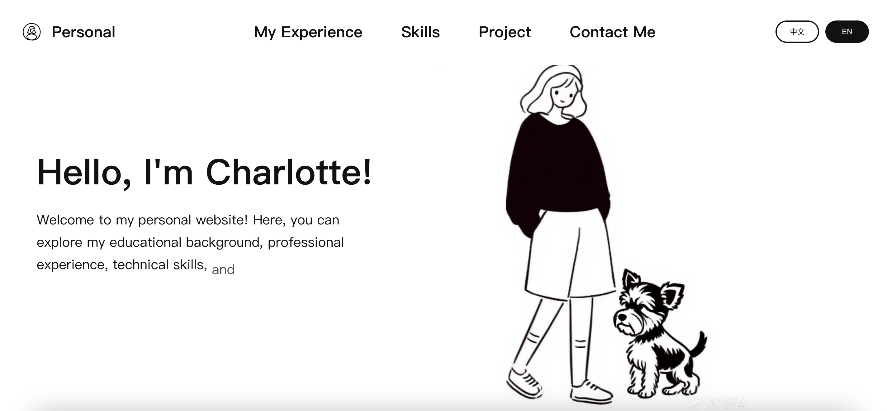

# 个人网站



## 🛠️ 技术栈

- **前端框架**: React 19
- **动画效果**: ReactBits 组件库
- **辅助动画**: GSAP
- **样式**: CSS3
- **构建工具**: Create React App

## 📁 项目结构

```
src/
├── App.css
├── App.js
├── components          # 动画组件
├── context             # 语言切换的全局状态管理
├── sections            # 页面区块
│   ├── Navbar
│   ├── PersonalSection
│   ├── PhotoWallSection
│   ├── ExperienceSection
│   ├── ProjectSection
│   ├── SkillsSection
│   ├── ContactSection
│   └── Footer
└── styles             # 样式文件
    ├── base.css
    └── main.css
...
```

## 🚀 快速开始

### 启动开发服务器

```bash
npm run dev
```
